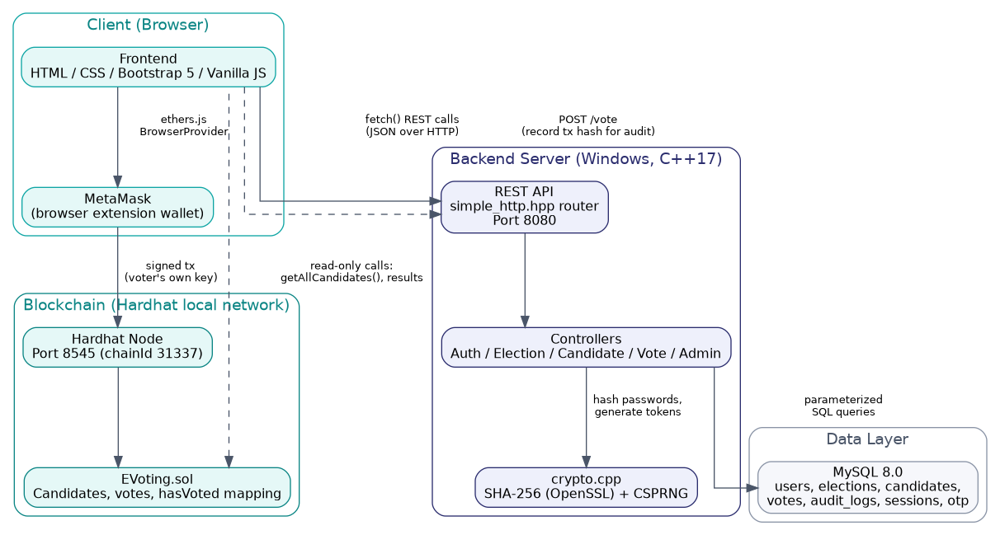
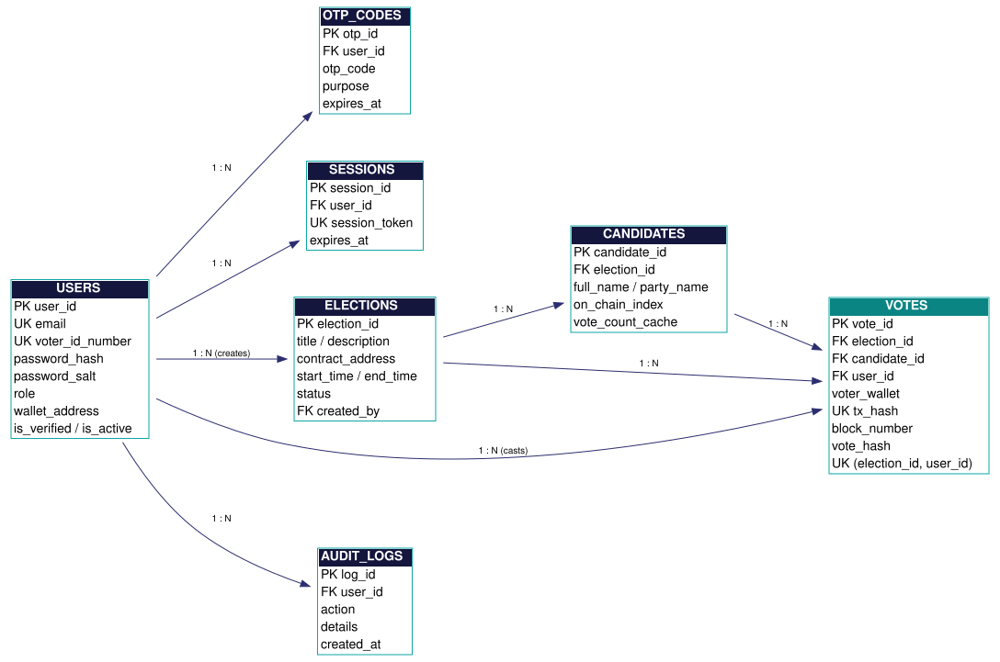
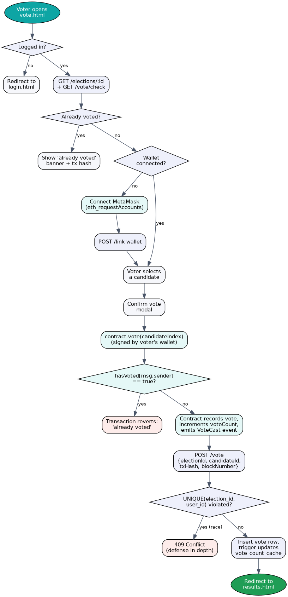

# System Architecture

## Overview

CivicChain uses a **hybrid architecture**: a conventional client-server
stack (C++ REST API + MySQL) handles accounts, sessions, and audit
logging, while a separate Ethereum smart contract is the single source of
truth for the votes themselves. The frontend talks to both independently.

**Why split it this way instead of putting votes in MySQL too?**
A database an administrator can `UPDATE` is a database an administrator
(or an attacker who compromises the server) can quietly rig. Putting the
vote tally on a blockchain, signed transaction-by-transaction by each
voter's own wallet, means no single party — including whoever runs the
web server — can alter a cast vote without every node in the network
noticing. MySQL still mirrors the result for fast reads and reporting,
but the blockchain is the ground truth that MySQL is checked against.

---

## Entity-Relationship Diagram

Key design decisions:
- `votes` has a `UNIQUE(election_id, user_id)` constraint — a **second,
  independent** guard against double voting, on top of the smart
  contract's own `hasVoted` mapping.
- `votes.tx_hash` is also `UNIQUE`, so the same on-chain transaction can
  never be recorded twice even under a network retry/race condition.
- `candidates.vote_count_cache` is kept in sync by a MySQL trigger
  (`trg_after_vote_insert`), so the results page never needs a slow
  `COUNT(*)` join under load.
- `candidates.on_chain_index` is the bridge between a MySQL candidate row
  and its position in the smart contract's `Candidate[]` array — this is
  how the backend knows which index to tell the frontend to call
  `contract.vote(index)` with.

---

## Voting Process Flowchart

This traces the exact logic implemented in `frontend/js/vote.js` and the
backend's `VoteController::handleCastVote`. Note the two separate
double-vote checks: the smart contract's `hasVoted` mapping (which would
make the MetaMask transaction itself revert) and the database's
`UNIQUE(election_id, user_id)` constraint (which would make the
follow-up `POST /vote` audit call fail with `409 Conflict`). In normal
operation only the first check ever fires; the second exists purely as a
safety net for edge cases like a user opening two tabs at once.

---

## Request lifecycle example: casting a vote

1. Voter clicks "Vote Now" on an active election → `vote.html` loads the
   election and candidates via `GET /elections/:id`.
2. If not yet connected, the voter clicks "Connect MetaMask" →
   `Wallet.connect()` requests account access and switches MetaMask to
   the Hardhat localhost network (adding it automatically if needed).
3. Voter selects a candidate and confirms in the modal.
4. `Wallet.castVote(onChainIndex)` calls `contract.vote(candidateId)` —
   this pops up MetaMask asking the voter to sign the transaction with
   their own private key. The backend is not involved in this step at
   all.
5. Once the transaction is mined, `vote.js` calls `POST /vote` with the
   resulting `txHash` and `blockNumber` so the backend can record the
   vote for the audit trail and the fast MySQL-backed results view.
6. The backend independently re-verifies the election is active and the
   candidate belongs to it before inserting — it does not blindly trust
   the frontend's claim that the on-chain vote succeeded.

---

## Why a custom HTTP/JSON layer instead of cpp-httplib / nlohmann::json?

The brief's top requirement is "runs on Windows with almost zero setup."
Vendoring the full cpp-httplib (~20,000 lines) and nlohmann/json
(~25,000 lines) single-header libraries would work, but:

- It means shipping (or requiring a download of) very large files just to
  get a thin slice of their functionality.
- It adds a dependency surface this project doesn't need — no
  multipart/form-data, no HTTPS, no streaming responses, none of which
  this REST API uses.

Instead, `backend/lib/simple_http.hpp` and `backend/lib/simple_json.hpp`
implement exactly the routing (including `:param` path segments), JSON
parsing/serialization, and CORS handling this API needs, directly on
Winsock2, in under 1,000 lines combined — with zero external downloads
and zero pthread/POSIX dependencies, keeping the Windows-only promise
airtight.

---

## Folder-to-responsibility map

| Folder | Responsibility |
|---|---|
| `backend/lib/` | Dependency-free HTTP server + JSON library |
| `backend/include/`, `backend/src/` | MVC-style controllers, services (auth, crypto, database) |
| `blockchain/contracts/` | `EVoting.sol` — the on-chain vote ledger |
| `blockchain/scripts/deploy.js` | Deploys the contract and auto-generates the frontend's contract config |
| `frontend/css/` | Design system: tokens (`variables.css`), reset (`base.css`), components (`components.css`), motion (`animations.css`) |
| `frontend/js/api.js` | Backend REST client |
| `frontend/js/wallet.js` | MetaMask + Ethers.js smart contract client |
| `database/schema.sql` | Full schema, seed admin account, view, trigger |
